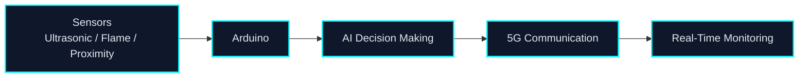
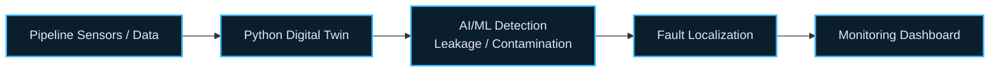
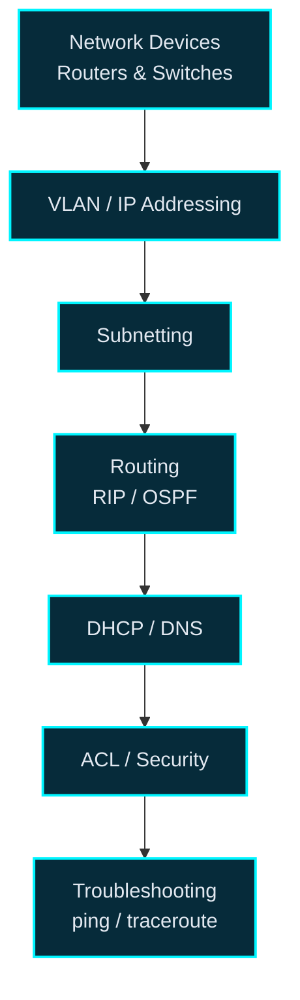
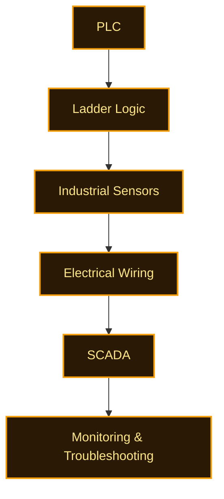

<!-- ============================================================
     SAKSHI GUPTA | GitHub Profile README
     Theme: dark futuristic (cyan / blue / purple)
     ============================================================ -->

 

  

<!-- Quick navigation -->

  

## ⚡ About Me

> *Building at the intersection of networks, automation, electronics and intelligent systems.*

I'm an **Electronics & Communication Engineering** student at **Banasthali Vidyapith** (B.Tech, 2022 – 2026). My work spans **networking**, **industrial automation**, **embedded systems** and **IoT**, with hands-on **AI-based projects** that connect them.

| Domain | What I work with |
|:--|:--|
| 🌐 **Networking** | TCP/IP, VLANs, subnetting, RIP / OSPF routing, DHCP, DNS and ACLs, practiced with Cisco Packet Tracer and CCNA-oriented fundamentals |
| 🔐 **Cybersecurity exposure** | Network security concepts, ACL configuration and basic firewall management during my internship |
| 🏭 **Industrial automation** | PLC programming in Ladder Logic, sensor integration, electrical wiring and SCADA monitoring |
| 🔌 **Embedded & IoT** | Arduino-based systems, digital electronics, VLSI and semiconductor design fundamentals |
| 🤖 **AI-based projects** | A spy robot, a digital-twin pipeline monitor and a smart traffic management system |

## 🪪 Quick Profile

<table>
  <tr>
    <td align="center" width="20%"><h3>🎓</h3><b>Education</b> B.Tech ECE Banasthali Vidyapith</td>
    <td align="center" width="20%"><h3>📍</h3><b>Location</b> Jaipur, Rajasthan India</td>
    <td align="center" width="20%"><h3>📊</h3><b>CGPA</b> 7.68</td>
    <td align="center" width="20%"><h3>💼</h3><b>Experience</b> Cybersecurity Intern + Network Engineer</td>
    <td align="center" width="20%"><h3>🧠</h3><b>Focus</b> Networking • Automation Embedded • IoT</td>
  </tr>
</table>

## 🧰 Tech Stack

<b>💻 Languages</b>

 

<b>🌐 Networking</b>

 

<b>🏭 Industrial Automation</b>

 

<b>🔌 Embedded & Electronics</b>

 

<b>🖥️ Operating Systems</b>

 

<b>🤖 Applied in Projects</b>

 

<a href="#top">⬆ back to top</a>

## 🛤️ Professional Journey

<table>
  <tr>
    <td align="center" width="25%">
        
      <b>🎓 Started B.Tech</b> Electronics &amp; Communication Engineering Banasthali Vidyapith
    </td>
    <td align="center" width="25%">
        
      <b>🔐 Cybersecurity Intern</b> Prontastic IT Services Pvt. Ltd.
    </td>
    <td align="center" width="25%">
        
      <b>🏭 Network Engineer</b> Bajaj Engineering Skills Training Ltd
    </td>
    <td align="center" width="25%">
        
      <b>🚀 B.Tech Completion</b> Banasthali Vidyapith
    </td>
  </tr>
</table>

## 💼 Experience

<table>
  <tr>
    <td>
      <h3>🔐 Cybersecurity Intern</h3>
      <b>Prontastic IT Services Pvt. Ltd.</b> 
      📅 February 2024 – January 2025 &nbsp;|&nbsp; 📍 Jaipur
        
      
      
      
      
      
      
      
      
        
      

        
<b>Key responsibilities</b>

        <ul>
          <li>Configured and monitored routers and switches using Cisco Packet Tracer.</li>
          <li>Worked with VLAN configuration.</li>
          <li>Performed IP addressing and subnetting.</li>
          <li>Implemented basic routing protocols including RIP and OSPF.</li>
          <li>Performed network troubleshooting using ping and traceroute.</li>
          <li>Applied network security concepts.</li>
          <li>Worked with ACL configuration.</li>
          <li>Gained exposure to basic firewall management.</li>
          <li>Worked with DHCP and DNS.</li>
        </ul>
      

    </td>
  </tr>
  <tr>
    <td>
      <h3>🏭 Network Engineer</h3>
      <b>Bajaj Engineering Skills Training Ltd</b> 
      📅 January 2026 – May 2026 &nbsp;|&nbsp; 📍 Jaipur
        
      
      
      
      
      
      
        
      

        
<b>Key responsibilities</b>

        <ul>
          <li>Contributed to industrial automation projects.</li>
          <li>Developed PLC programs using Ladder Logic.</li>
          <li>Supported system integration activities.</li>
          <li>Performed industrial sensor integration and electrical wiring.</li>
          <li>Troubleshot automation systems.</li>
          <li>Monitored process performance through a SCADA interface for real-time supervision.</li>
          <li>Developed and troubleshot industrial automation applications.</li>
          <li>Assisted with industrial manufacturing and process-control workflows.</li>
          <li>Gained practical exposure to semiconductor fabrication processes.</li>
        </ul>
      

    </td>
  </tr>
</table>

<a href="#top">⬆ back to top</a>

## 🚀 Projects

### 🤖 Spy Robot with 5G AI Integration

Designed and developed an **autonomous spy robot** using Arduino, 5G communication and AI-based decision-making for real-time surveillance.

| | |
|:--|:--|
| **Key features** | Arduino-based autonomous robot • 5G communication • AI-based decision-making • Real-time surveillance |
| **Sensors** | Ultrasonic • Flame • Proximity |
| **Technical highlights** | Obstacle detection • Threat monitoring • Modular architecture |
| **Real-world applications** | Border security • Industrial inspection • Search and rescue |

 

### 💧 Smart Underground Water Pipeline Monitoring System

Developed a **Digital Twin–based** monitoring system in Python to simulate and monitor the real-time condition of underground water pipelines.

| | |
|:--|:--|
| **Key features** | Real-time pipeline monitoring • AI/ML-based leakage detection • Contamination detection • Predictive maintenance |
| **Technical highlights** | Real-time monitoring dashboard • Pipeline health visualization • Fault localization • Identification of affected pipeline sections |
| **Goals / benefits** | Early detection of leakage and contamination • Reduced operational downtime • Improved maintenance efficiency • Reduced response time |

 

### 🚦 Smart Traffic Management System using AI IoT

Designed and developed an **AI-powered traffic management system** to optimize traffic flow and reduce congestion at road intersections.

| | |
|:--|:--|
| **Key features** | Real-time vehicle detection • Vehicle counting • Vehicle classification • Traffic-density analysis |
| **Technical highlights** | Live camera feeds • Adaptive signal timing • Live traffic monitoring • Traffic statistics visualization • Data-driven decision-making |
| **Goals / benefits** | Optimize traffic flow • Reduce congestion • Improve traffic efficiency • Reduce waiting time |
| **Real-world application** | Road intersections and intelligent transportation systems |

<a href="#top">⬆ back to top</a>

## 🌐 Networking

Hands-on networking practice from my Cybersecurity Internship, built around **Cisco Packet Tracer**, with **CCNA**-aligned fundamentals.

## 🏭 Industrial Automation

From my Network Engineer role at Bajaj Engineering Skills Training Ltd: PLC programming, sensor integration, wiring and SCADA-based supervision.

- **PLC programming** and **Ladder Logic** for automation applications
- **Sensor integration** and **electrical wiring**
- **SCADA monitoring** for real-time supervision
- **Troubleshooting** automation systems
- Exposure to **industrial manufacturing** workflows and **semiconductor fabrication** processes

## 🔌 Embedded & Electronics

<table>
  <tr>
    <td align="center" width="20%"><b>Arduino</b> Microcontroller-based builds</td>
    <td align="center" width="20%"><b>IoT</b> Connected systems</td>
    <td align="center" width="20%"><b>Digital Electronics</b> Core fundamentals</td>
    <td align="center" width="20%"><b>VLSI</b> Chip-design fundamentals</td>
    <td align="center" width="20%"><b>Semiconductor Design</b> Foundational knowledge</td>
  </tr>
</table>

These foundations come together in my **Spy Robot with 5G AI Integration**, where Arduino, ultrasonic, flame and proximity sensors and AI-based decision-making combine into one modular embedded system. IoT also underpins the **Smart Traffic Management System**.

<a href="#top">⬆ back to top</a>

## 📊 GitHub Activity

 

 

Stats are pulled live from public GitHub data for <code>03-sakshi</code>.

## 🤝 Let's Connect

  

📍 Jaipur, Rajasthan, India &nbsp;•&nbsp; 📞 +91 7033046002

 

<i>Open to conversations about networking, industrial automation, embedded systems and IoT.</i>

<!-- ============================ FOOTER ============================ -->

