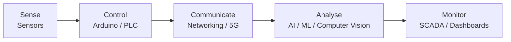
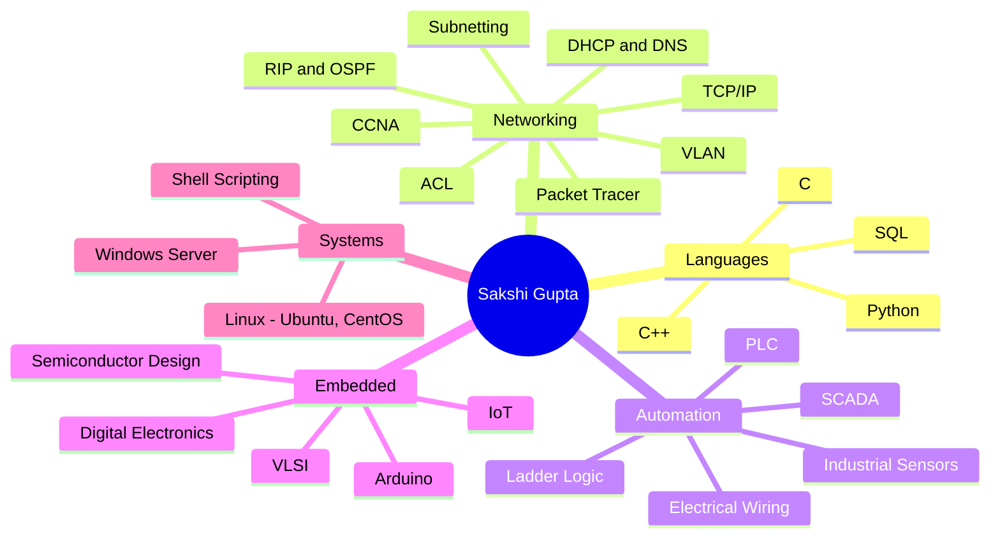
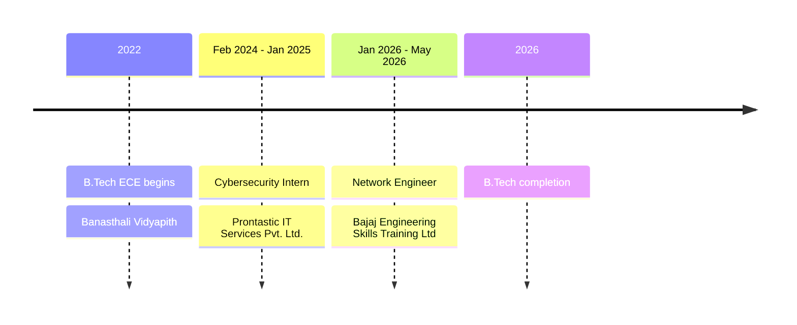
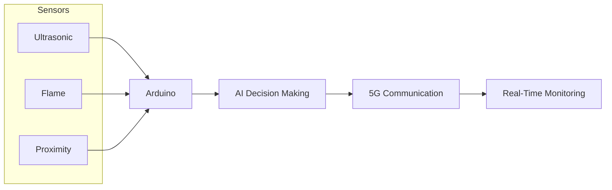
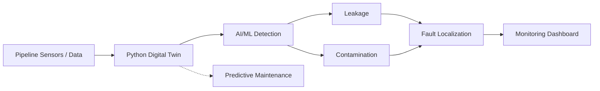
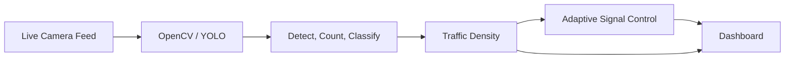
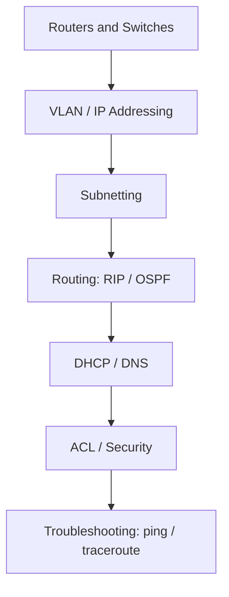
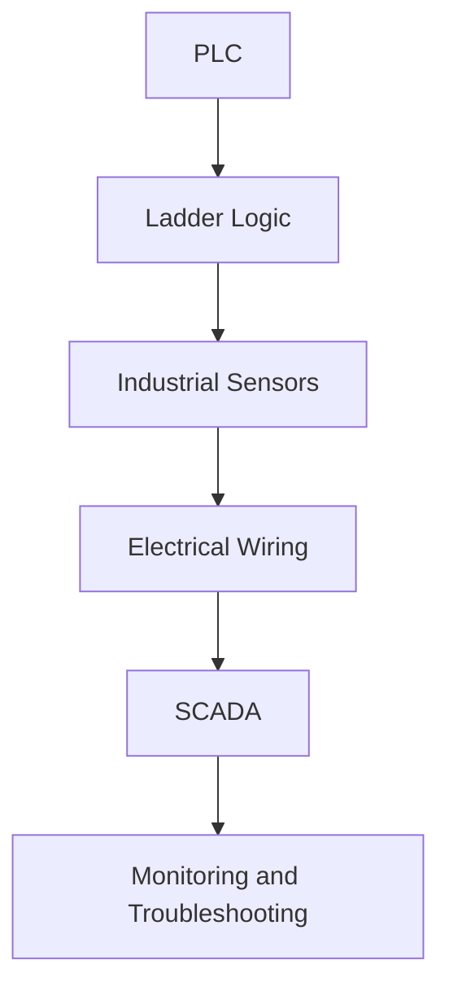
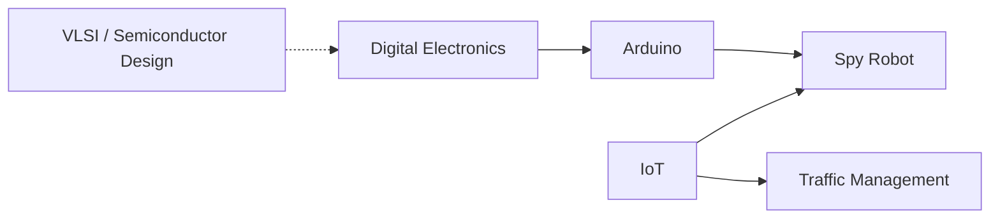

# Sakshi Gupta

---

## About

Electronics & Communication Engineering student (B.Tech, Banasthali Vidyapith, 2022 – 2026, CGPA 7.68), based in Jaipur.
I work where **networks, automation and embedded systems** meet, and apply AI to real-world monitoring problems.

## How my work fits together

## Skills

## Journey

## Experience

<b>Cybersecurity Intern</b> · Prontastic IT Services Pvt. Ltd. · Feb 2024 – Jan 2025 · Jaipur

- Configured and monitored routers and switches using Cisco Packet Tracer
- VLAN configuration, IP addressing and subnetting
- Basic routing with RIP and OSPF
- Troubleshooting with ping and traceroute
- ACL configuration, DHCP and DNS, network security concepts, exposure to basic firewall management

<b>Network Engineer</b> · Bajaj Engineering Skills Training Ltd · Jan 2026 – May 2026 · Jaipur

- Developed PLC programs in Ladder Logic and supported system integration
- Industrial sensor integration and electrical wiring
- Troubleshot automation systems and monitored processes through SCADA
- Exposure to industrial manufacturing, process control and semiconductor fabrication

---

## Projects

### Spy Robot with 5G AI Integration

Autonomous robot using Arduino, 5G communication and AI-based decision-making for real-time surveillance.
**Applications:** border security, industrial inspection, search and rescue.

### Smart Underground Water Pipeline Monitoring

Digital Twin in Python that simulates and monitors underground pipeline condition in real time.
**Outcomes targeted:** early leak and contamination detection, less downtime, faster response.

### Smart Traffic Management System (AI + IoT)

Computer-vision system that optimises traffic flow and reduces congestion at intersections.
**Stack:** OpenCV, YOLO.

---

## Domains

### Networking

### Industrial Automation

### Embedded & Electronics

Arduino, IoT, digital electronics, VLSI and semiconductor design. Applied hands-on in the Spy Robot; IoT also underpins the traffic system.

---

## Contact

📧 [sakshigupta2033@gmail.com](mailto:sakshigupta2033@gmail.com) · 💼 [LinkedIn](https://linkedin.com/in/sakshi-gupta03) · 🐙 [GitHub](https://github.com/03-sakshi) · 📍 Jaipur, Rajasthan, India

Building at the intersection of networks, automation, electronics and intelligent systems.

